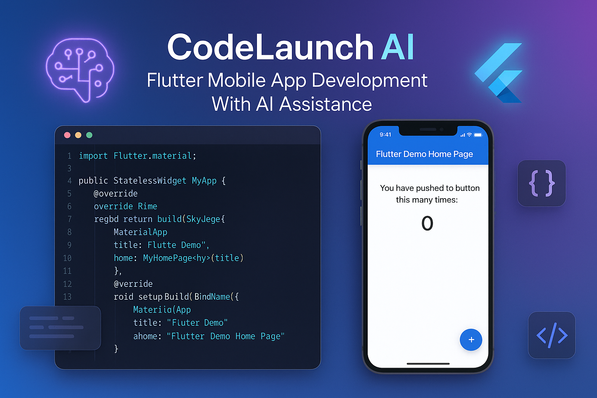

# CodeLaunch.ai

[](https://github.com/khamis1992/code-launch)

Welcome to CodeLaunch.ai, your AI-powered companion for building Flutter applications. This open-source project provides a powerful and intuitive environment for generating, testing, and deploying Flutter apps with the help of cutting-edge AI models.

## ✨ Features

- **🚀 AI-Powered Flutter Development**: Generate high-quality Flutter code from natural language prompts.
- **🎨 Professional UI/UX**: A clean and modern interface designed for a seamless development experience.
- **🔌 Extensible AI Providers**: Easily integrate with various AI models and services.
- **💻 Cross-Platform**: Develop for both mobile and desktop environments.
- **📦 Organized Project Structure**: A well-organized and scalable project structure.
- **🔧 Customizable and Extensible**: Easily customize and extend the functionality to fit your needs.

## 🚀 Getting Started

### Prerequisites

- [Node.js](https://nodejs.org/en/download/) (LTS version)
- [pnpm](https://pnpm.io/installation)
- [Git](https://git-scm.com/downloads)

### Installation

1. **Clone the repository**:
   ```bash
   git clone https://github.com/khamis1992/code-launch.git
   cd code-launch
   ```

2. **Install dependencies**:
   ```bash
   pnpm install
   ```

3. **Run the development server**:
   ```bash
   pnpm run dev
   ```

## ⚙️ Configuration

Create a `.env.local` file in the root of the project and add your API keys for the AI providers you want to use. You can find a complete list of supported providers and their configuration options in the `docs/` directory.

## 🤝 Contributing

We welcome contributions from the community! If you'd like to contribute, please check out our [Contributing Guidelines](docs/CONTRIBUTING.md) and the [Project Roadmap](docs/PROJECT.md).

## 📄 License

This project is licensed under the MIT License. See the [LICENSE](LICENSE) file for details.


